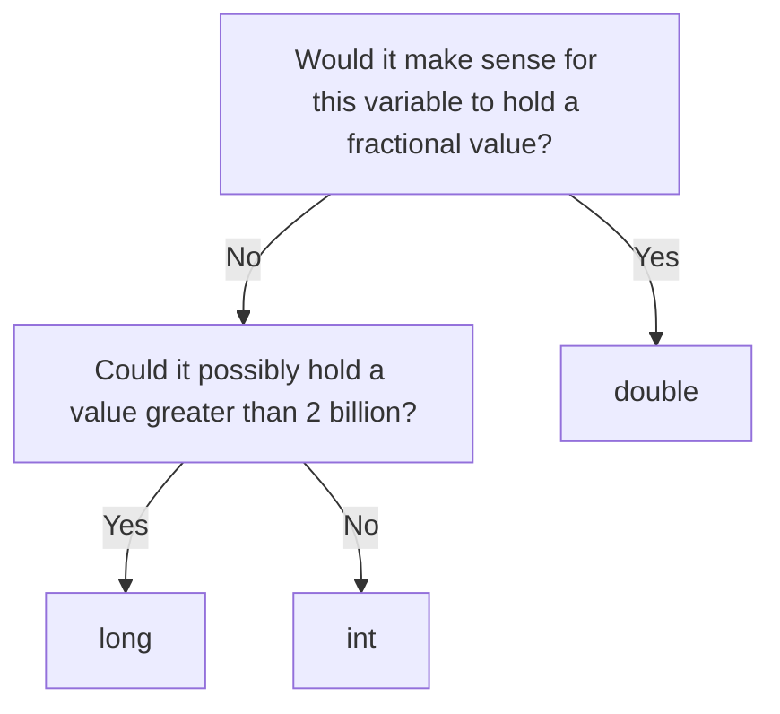

Numbers are the most commonly-used types of variables, but there are a couple varieties to be aware of, due to how computers store them.

## How Data Storage Works in Computers
This section goes into the details of how computers interpret numbers. It's totally fine to skip over this, as you'll never have to worry at this level. In fact, the point of programming languages is to hide these kind of details.

Computers are digital, meaning fundamentally they can only work on binary values, such as 1 or 0. This single piece of information is called a _bit_. Storing more complex data is done with combinations of multiple bits. Computers also have a maximum number of bits they can work with at a time.

With a digital number system, usually only whole numbers, also known as integers, can be expressed. The maximum value that can be held this way is equal to $2^{n-1}-1$[^1], where N is the number of bits used. For 32-bit systems, this is 2,147,483,647. For 64-bit systems, this is 9,223,372,036,854,775,807. Although the 32-bit number is big, for some applications it can't hold the full number.

But what about fractional numbers? Computers do this by allowing the decimal point to shift around in the number. This lets parts of the bits to refer to a whole number, and parts of them to a fraction. These are called _floating-point_ numbers. A 32 bit floating point number is high-precision, but can run into problems with losses of precision if the whole number part grows too large. This is much less common with 64-bit floating point numbers, so we generally use those.

## Integers
Integers (`int`) are the most basic form of numbers. They can hold whole numbers between -2,147,483,647 and 2,147,483,647. These are often used for applications like counting how many times an event has happened, or how many variables are part of a larger data structure.
## Longs
Longs (`long`) are similar but more specialized than integers. Use these only if there's a possibility of a variable taking on an absolutely massive value (outside of the bounds of an integer). Typically, this means keeping track of a clock value at high precision.
## Doubles
Doubles (`double`) are used whenever you need to express a number that isn't necessarily whole.

## Picking a Number Type

## Number Operations
Standard mathematical operations between numbers are fairly intuitive.

{{spoiler("Show", compilerEmbed(entryPoint("
int a = 5;
double b = 1.5;
double c = a + b;
// int c = a + b; // doesn't work!
System.out.println(c);

long d = 3;
double e = b;
System.out.println(d * e);

a = 7;
System.out.println(a - d);
")))}}

The above illustrates how the compiler is generally able to translate between these types as needed. 

### Exercise #1
Try uncommenting the 4th line of code and commenting line #3 to see what happens!

{{spoiler("Solution", "The compiler throws an error because you're trying to turn a number (in this case a double) into something less general (an int).")}}

## Typecasting
As users, we can also convert values between types. This is done by writing `(new type) value`. Note that this doesn't change the type of the base variable, just creates a new equivalent value of the other type. Lots of casts (most) are not valid, and will throw a compiler error.

{{spoiler("Show", compilerEmbed(entryPoint("
System.out.println(58);
System.out.println((double) 58);
")) + "\n58 and 58.0 are identical, the empty decimal space is Java's way of letting us know it was a double.")}}

## Division
There's a basic operation missing, though. Division is a little more complicated.

{{spoiler("Show",compilerEmbed(entryPoint("
System.out.println(3 / 2);
")))}}

Huh?

It turns out that division of an integer by an integer always returns an integer, even if mathematically the answer is not.

### Exercise #2
Figure out if integer division returns a rounded (closest whole number) or truncated (remove everything after the decimal point) number.

{{spoiler("Solution", "The number is truncated.\n\n" + compilerEmbed(entryPoint("
System.out.println(199 / 100);
")))}}

###  Exercise #3
Find a way to get a double result from a division of two integers. Use the below starting point and what you've seen so far!

{{spoiler("Show", compilerEmbed(entryPoint("
int a = 5;
int b = 2;
double c = a / b; // change this line!
System.out.println(c);
")))}}

{{spoiler("Hint #1", "What if one of the inputs wasn't an integer?")}}
{{spoiler("Hint #2", "Typecast one of the input variables so that it's no longer pure integer division.")}}
{{spoiler("Solution", compilerEmbed(entryPoint("
int a = 5;
int b = 2;
double c = (double) a / b; // or the other way around, or both
System.out.println(c);
")))}}

[^1]: For numbers that can be positive or negative. Positive-only numbers are $2^{n}-1$, but they aren't seen in Java.

{{compilerEmbedEOF()}}