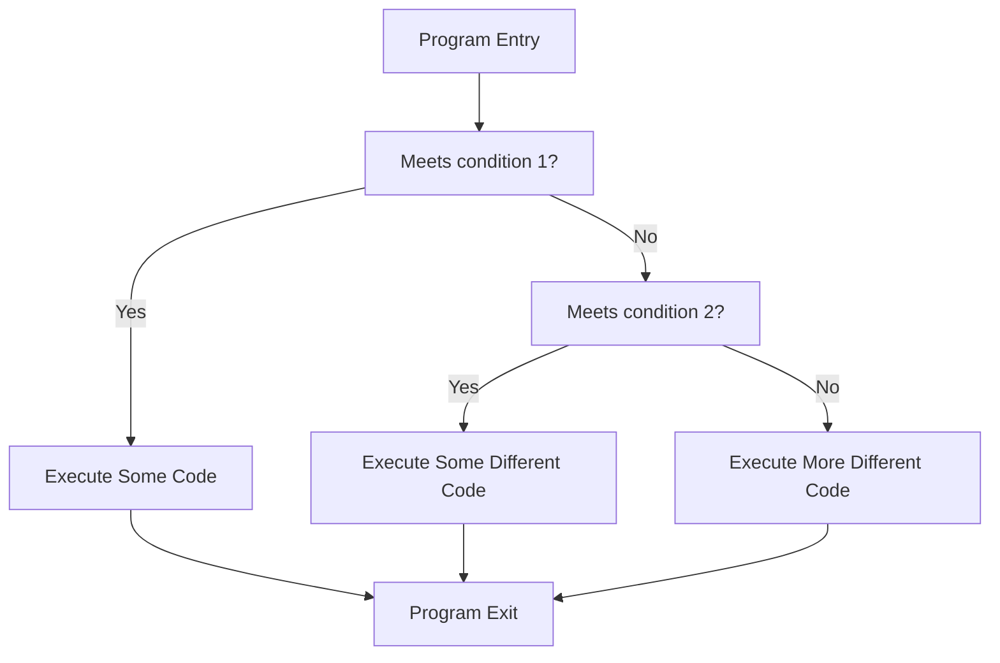

The data type for a variable that can only store one fundamental piece of information is called a _boolean_. A boolean only has two different possible states: true or false, yes or no, 1 or 0, etc.

In Java the type name is `boolean`, and the possible values are expressed as `true` or `false`.

The primary use of booleans is for branching program logic. This lets us execute different code depending on conditions that can change as the code runs.

This dramatically increases the number of useful things we can do in our programs.

## If/ Else
The statement used for program branching takes the form:
```
if (condition1) {
    // execute some code...
} else if (condition2) {
    // execute some different code...
} else {
    // more different code...
}
```

Each different condition is a boolean value (or evaluates to a boolean value). A flowchart of how an if statement would look something like this:



An if statement can include as many `else if` conditions as you like, including none. `else` is optional but can only have one instance.

### Exercise 1

Write a simple if/else statement to print different messages depending on whether `isFriend` is true.

{{spoiler("Show", compilerEmbed(entryPoint("
boolean isFriend = true; // pretend that this value isn't known
")))}}

{{spoiler("Solution", compilerEmbed(entryPoint('
boolean isFriend = true; // pretend that this value isn\'t known

if (isFriend) {
    System.out.println("Hello! Nice to see you again!");
} else {
    System.out.println("Nice to meet you!");
}
')))}}

## Comparisons
So far we have no way of converting between "regular" values and booleans, meaning that our branching logic will be limited. Comparisons check for equality[^1] between variables of the same type, returning `true` if they are equal and `false` if not.[^2]

A comparison is written using the syntax `a == b`. This expression evaluates to (can be substituted for) a boolean.

!!! warning
    The syntax `==` (comparison) looks very similar to `=` (assignment). 
    There can be some cryptic error messages that arise from mixing these up.

### Exercise 2
Write a piece of code that prints `6` if a variable is equal to 5, `4` if the variable is equal to 9, and `0` otherwise.

{{spoiler("Show", compilerEmbed(entryPoint("
int a = 5; // pretend this can change
")))}}

{{spoiler("Solution", compilerEmbed(entryPoint("
int a = 5; // pretend this can change

if (a == 5) {
    System.out.println(6);
} else if (a == 9) {
    System.out.println(4);
} else {
    System.out.println(0);
}
")))}}

### Exercise 2.5
Rewrite your solution to Exercise 2, using only one print statement.

{{spoiler("Hint", "Reread section 1 and specifically variable declaration")}}

{{spoiler("Solution", compilerEmbed(entryPoint("
int a = 5; // pretend this can change

int out;

if (a == 5) {
    out = 6;
} else if (a == 9) {
    out = 4;
} else {
    out = 0;
}

System.out.println(out);
")))}}

While working on that exercise, you may have noticed that the compiler was not very happy with you if you failed to assign a value to `out` in all program branches. If you declare a variable, it must be defined for every program flow before you use it. Additionally, if you declare a variable inside a program branch, it can't be used outside of it.

## Boolean Logic

| | 0 | 1 |
| --- | --- | --- |
| 0 | 0 | 1 |
| 1 | 1 | 1 |

Other

[^1]: "Equality" can be somewhat tricky to figure out automatically for more complex data types. In these cases, the type itself provides a specification for the equality check.

[^2]: Checks for equality of floating-point variables occasionally don't behave entirely correctly. This is because floating-point numbers can be susceptible to a very small amount of rounding error (this is what's happening if you ever see a computer, for example, returning `41.9999999999998` instead of `42`).

{{compilerEmbedEOF()}}
